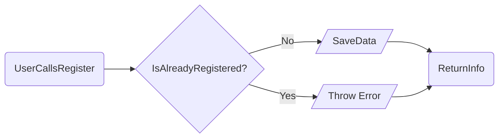

# typescript-api

## Roadmap

User Register

```mermaid
graph LR
A(UserCallsRegister) --> B{IsAlreadyRegistered?}
B -- No --> C[/SaveData/]
B -- Yes --> D[/Throw Error/]
C --> E(ReturnInfo)
D --> E
```

